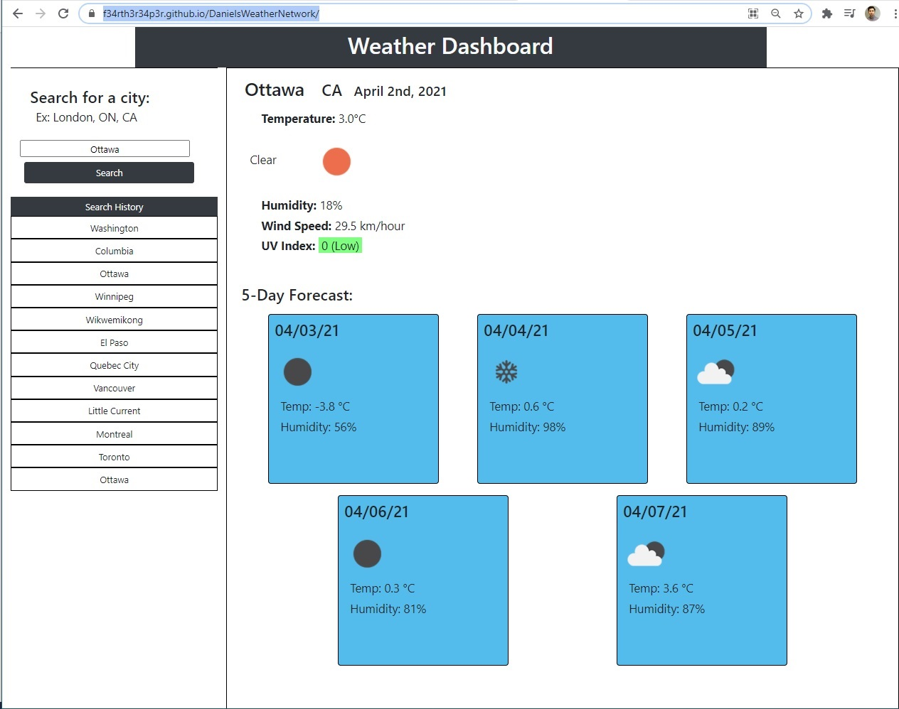

# Weather Dashboard - Bootcamp Spot Homework #6

## Overview

This document describes the components of a weather dashboard powered by Javascript, HTML, and CSS, using API to fetch data from the OpenWeatherData website

This website is meant to demonstrate knowledge and competency in the following:

- API calls and parsing,
- DOM and styling manipulation througj Javascript 
- forEach loops,
- The Moment library
- LocalStorage; setting and getting.

# Features
The following are the specific steps involved in building the code:

## Javascript

- Gathered the current date using Moment (`moment()`) and displays it at the top of the page.
- Gathers a 'search history' based either on i) local Storage or ii) an arbitrary array of three cities. The localStorage array has priority
- A `renderHistory()` function which transforms the `search history` array into a set of divs with a matching class title.
- An `eventListener` (lines 75-80) which launches the `getCityWeather(targetClick)` and `get5Day(targetClick)` functions, using the value of the clicked Search History div as the parameter.
- An `eventListener` (lines 88-97) which launches the `getCityWeather(targetClick)` and `get5Day(targetClick)` functions, which use the text input `targetClick` as the parameter.
- The function `getCityWeather(citySearchString)` (lines 99-197), which uses two APIs. 
-- The 'Current Weather Data' API, which uses a city/state/country name to return latitude, longitude, the current temperature, humidity, wind speed, and corresponding weather icon as a `.png`.
-- The 'One Stop' API, which uses the Current Weather API's latitude and longitude to return the UV Index.
- The function `get5Day(citySearchString)` (lines 199-293), which uses the '5 Day/3 Hour Forecast' API to return the predicted weather, humidity, png icon, and the date.

# File Architecture

File name | Function
------------ | -------------
index.html | HTML
style.css | CSS stylesheet
script.js| Javascript
assets | container for /icons, which contains 18 png icons which correspond to the weather conditions (i.e., cloudly, sunny, clear, etc.)

# Website Appearance 
Once loaded, the website should look like this:  

This website is available at the following URL:   
https://f34rth3r34p3r.github.io/DanielsWeatherNetwork/

You can access the `.git` files at:
https://github.com/F34rTh3R34p3r/DanielsWeatherNetwork.git

# Contributor(s)
Daniel Pisani (F34rTh3R34p3r)

# MIT License

Copyright (c) 2021 Daniel Pisani (F34rTh3R34p3r) 

Permission is hereby granted, free of charge, to any person obtaining a copy of this software and associated documentation files (the "Software"), to deal in the Software without restriction, including without limitation the rights to use, copy, modify, merge, publish, distribute, sublicense, and/or sell copies of the Software, and to permit persons to whom the Software is furnished to do so, subject to the following conditions:

The above copyright notice and this permission notice shall be included in all copies or substantial portions of the Software.

THE SOFTWARE IS PROVIDED "AS IS", WITHOUT WARRANTY OF ANY KIND, EXPRESS OR IMPLIED, INCLUDING BUT NOT LIMITED TO THE WARRANTIES OF MERCHANTABILITY, FITNESS FOR A PARTICULAR PURPOSE AND NONINFRINGEMENT. IN NO EVENT SHALL THE AUTHORS OR COPYRIGHT HOLDERS BE LIABLE FOR ANY CLAIM, DAMAGES OR OTHER LIABILITY, WHETHER IN AN ACTION OF CONTRACT, TORT OR OTHERWISE, ARISING FROM, OUT OF OR IN CONNECTION WITH THE SOFTWARE OR THE USE OR OTHER DEALINGS IN THE SOFTWARE.